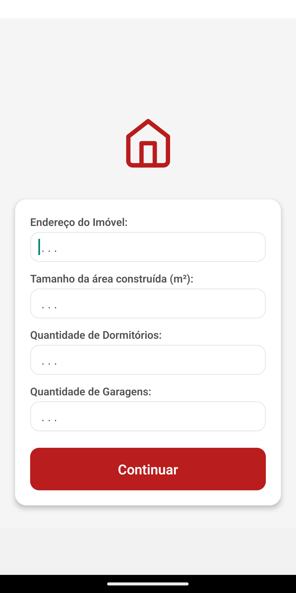
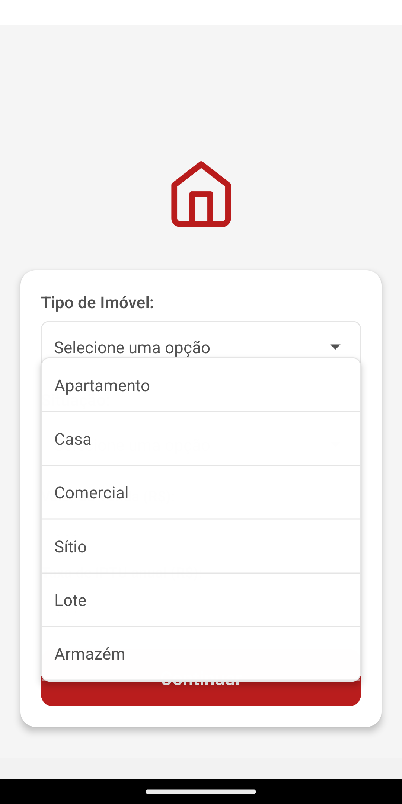
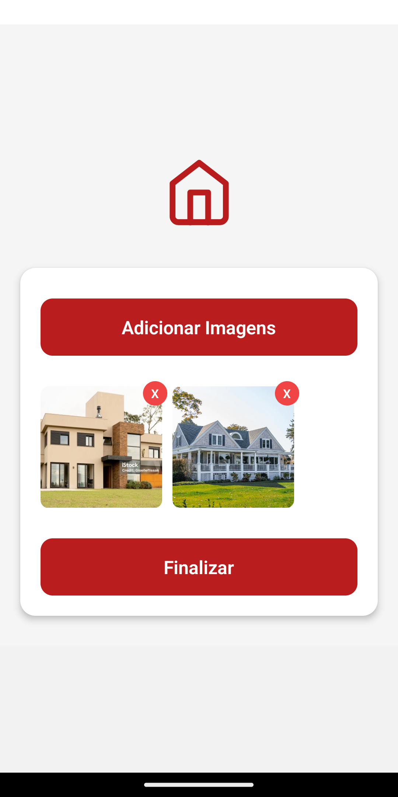
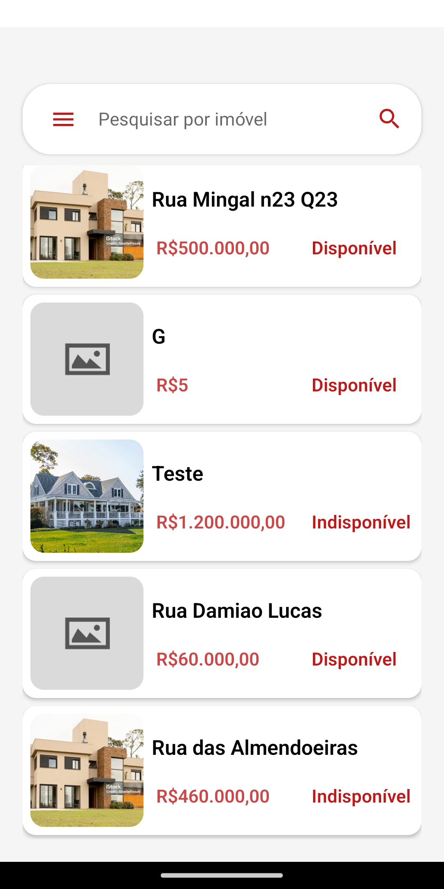
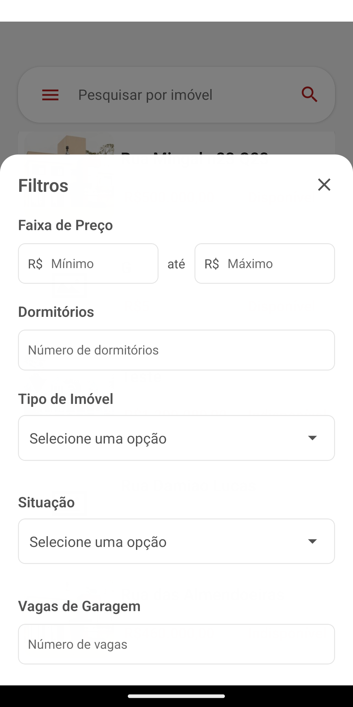
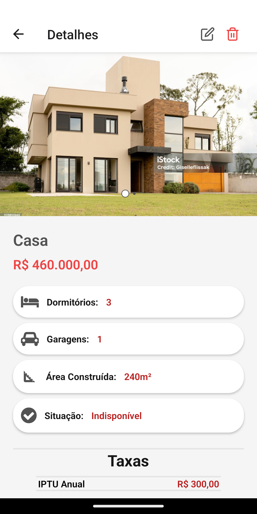
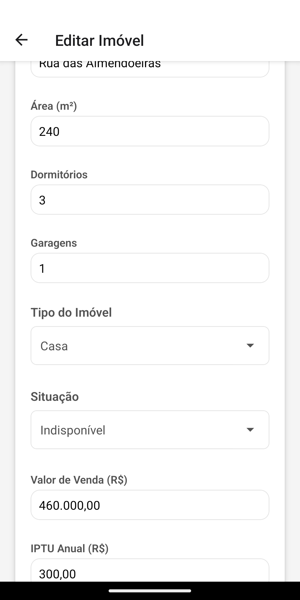
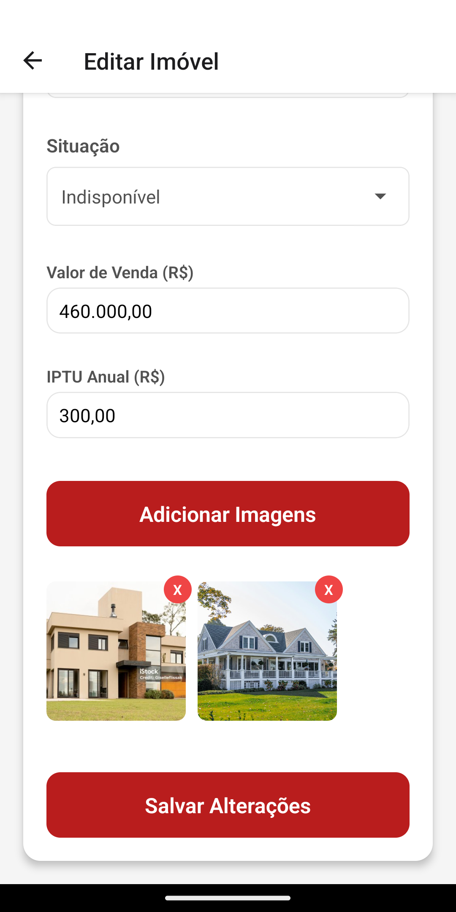

# SV Imobiliária - App de Gestão Imobiliária

## 📱 Sobre o Projeto
SV Imobiliária é um aplicativo móvel desenvolvido para facilitar a gestão de imóveis, permitindo o controle e organização de propriedades, clientes e processos imobiliários.

## 🚀 Tecnologias Utilizadas
- React Native
- Expo
- SQLite (expo-sqlite)
- React Navigation
- AsyncStorage
- Expo Image Picker
- Expo Document Picker
- Expo File System

## 📋 Pré-requisitos
- Node.js
- npm ou yarn
- Expo CLI
- Android Studio (para desenvolvimento Android)
- Xcode (para desenvolvimento iOS, apenas em macOS)

## 🔧 Instalação

1. Clone o repositório:
```bash
git clone https://github.com/TheGuiF/gestao-imobiliaria-app.git
```

2. Instale as dependências:
```bash
npm install
# ou
yarn install
```

3. Inicie o projeto:
```bash
npm start
# ou
yarn start
```

## 🛠️ Scripts Disponíveis
- `npm start` ou `yarn start`: Inicia o projeto em modo de desenvolvimento
- `npm run android` ou `yarn android`: Executa o app no Android
- `npm run ios` ou `yarn ios`: Executa o app no iOS
- `npm run web` ou `yarn web`: Inicia o projeto na versão web

## 📱 Funcionalidades
### Gestão de Imóveis
- Cadastro completo de imóveis com informações detalhadas
- Edição, atualização e remoção de dados dos imóveis
- Gerenciamento de múltiplas imagens por imóvel
- Catálogo organizado de imóveis disponíveis
- Visualização detalhada de cada imóvel

### Sistema de Busca e Filtros
- Busca por texto (endereço e tipo de imóvel)
- Filtros avançados:
  - Faixa de preço (mínimo e máximo)
  - Número de dormitórios
  - Tipo de imóvel (Apartamento, Casa, Comercial, Sítio, Lote, Armazém)
  - Situação (Disponível/Indisponível)
  - Número de vagas de garagem
- Limpeza rápida de filtros aplicados

### Interface e Usabilidade
- Interface intuitiva e amigável
- Navegação fluida entre telas
- Suporte a gestos e interações touch
- Design responsivo e moderno

### Armazenamento e Dados
- Armazenamento local com SQLite
- Persistência de dados offline
- Gerenciamento eficiente de imagens
- Backup e restauração de dados

## 📄 Licença
Este projeto é licenciado sob os termos da [Licença MIT](LICENSE).

Você é livre para usar, copiar, modificar, mesclar, publicar, distribuir, sublicenciar e/ou vender cópias do software, desde que preserve o aviso de copyright.

> SPDX-License-Identifier: MIT

## 👥 Desenvolvedores
- TheGuiF - Desenvolvimento 
- jhonatadavn - Contribuições no projeto e desenvolvimento do Banco de Dados

## 📧 Contato
- Guilherme Farias: 
  - Linkedin: https://www.linkedin.com/in/guilherme-farias-59a915350/
  - GitHub: https://github.com/TheGuiF
- Jhonatã Caldeira:
  - Linkedin: https://www.linkedin.com/in/jhonatã-caldeira-ab6529232/
  - GitHub: https://github.com/jhonatadavn

## 🙏 Agradecimentos
- **Alessandro Larangeiras** - Pela orientação e suporte durante o desenvolvimento do projeto
- **Estácio** - Pela oportunidade de desenvolver este projeto como parte da formação acadêmica
- **Thayna** - Pelo suporte e contribuição no design do projeto, trazendo uma visão única e criativa para a interface do aplicativo

### Menções Especiais
- **Família e Amigos** - Pelo apoio e incentivo durante todo o processo de desenvolvimento
- **Comunidade React Native** - Pelos recursos e documentação disponíveis que foram fundamentais para o desenvolvimento

## 🖼️ Screenshots

### Tela Inicial


---

### Fluxo de Criação de Imóvel

<p float="left">
  
  
  
  
</p>

---

### Catálogo de Imóveis


---

### Filtros de Pesquisa


---

### Detalhes do Imóvel

<p float="left">
  
  
</p>

---

### Edição de Imóvel

<p float="left">
  
  
</p>

---

### Confirmação de Exclusão

